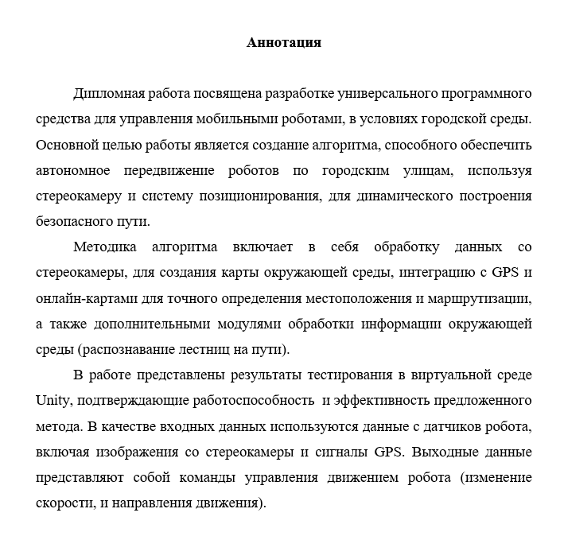
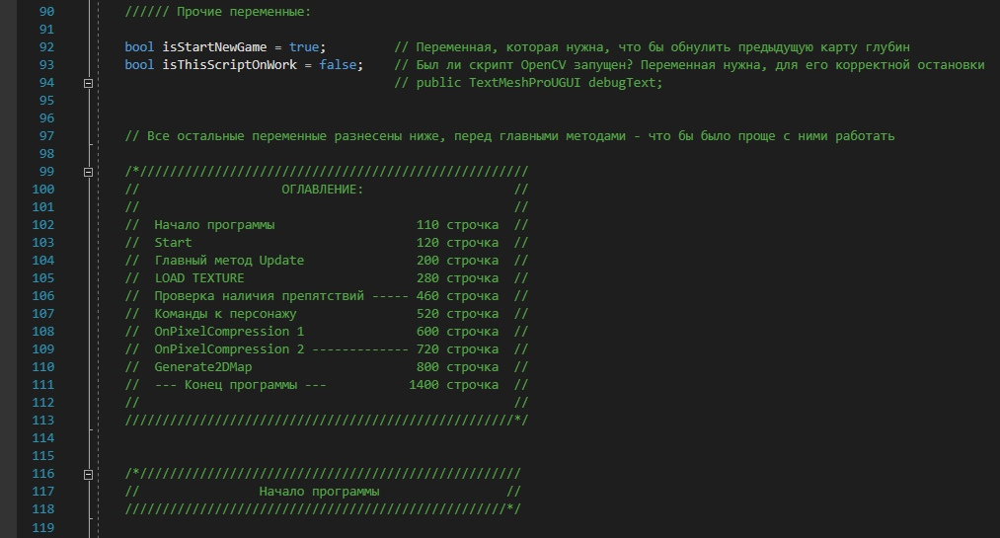
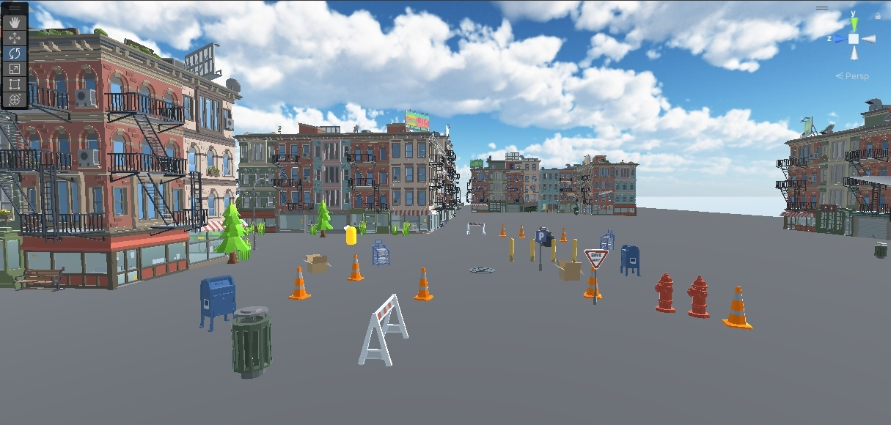
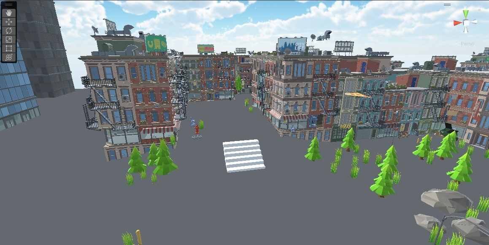
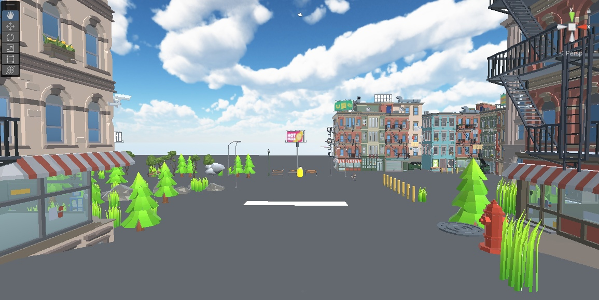
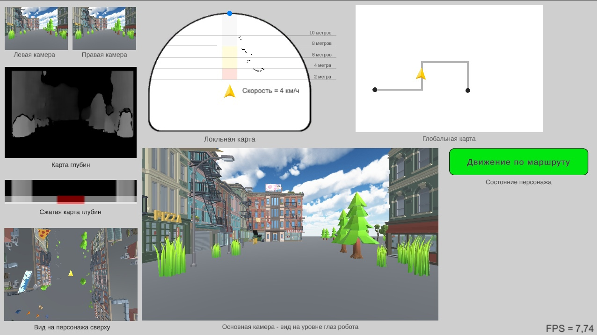

# Дипломный проект

Это мой дипломный проект - Создание алгоритма для ориентирования робота на улицах города

Полное название ВКР: "Разработка программного средства для ориентации и обхода препятствий в городской черте, для мобильного робота, с использованием стереокамеры"

## Материалы работы

Все материалы работы, включая:
* Отчёт (ВКР)
* Доклад, презентацию и видеодемонстрацию
* Проект на Unity (Версии 2022.3 LTS)
* Билд проекта на Unity (под Windows)
* Исходники и билды дополнительных модулей - для работы со стереокамерой (на C#) и нейросетью по распознаванию лестниц (на Python)
* А также другие материалы - в том числе и 20-минутный гайд по моему проекту внутри Unity

Доступны по ссылке: https://disk.yandex.ru/d/bwLt_C1agOAf7w

## Краткое описание проекта:

 

Подробное описание этапов и методов разработки и исследования работы можете просмотреть в отчёте по ВКР 
(который находится внутри архива, доступного по ссылке выше на Яндекс диске)

## Изображения с разработки проекта:

 
 
 
 
 

_Не забывайте, что в архиве есть видеодемонстрация и презентация проекта. Если заинтересовались - то легко сможете узнать больше об этом проекте от туда ✨_
