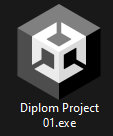
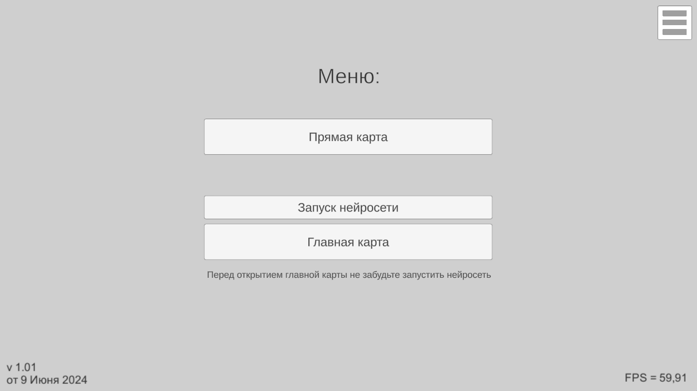
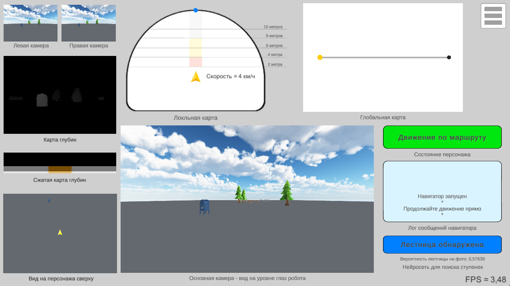
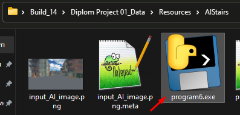
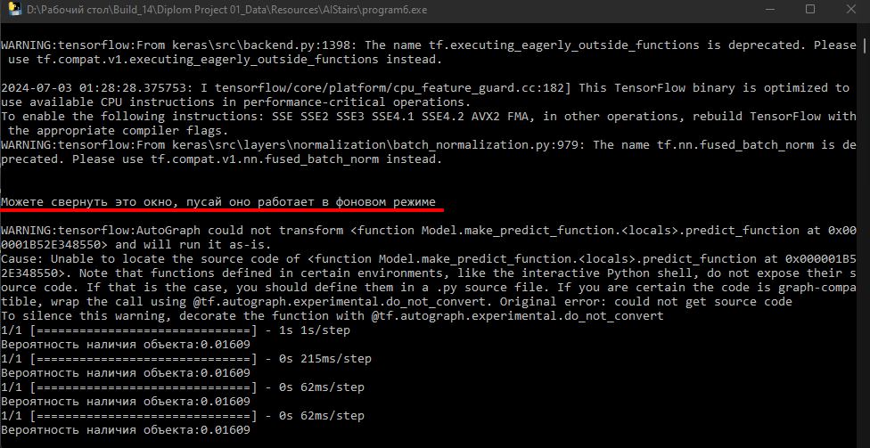
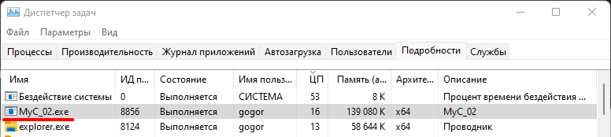
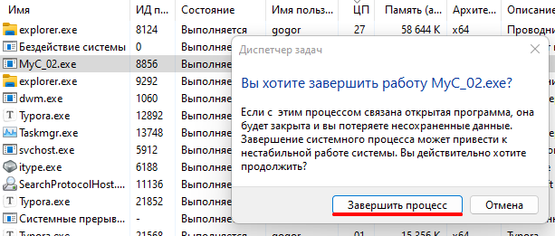
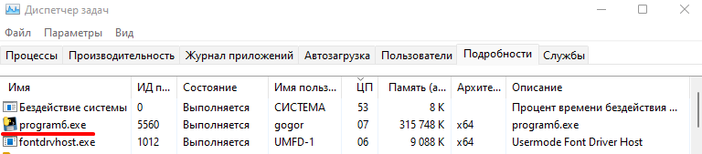

# Файл с инструкциями для запуска демонстрации дипломной программы

---

Демонстрационная программа запускается только в системе Windows. Системные требования: Win 7, 10 или 11. Крайне желательно наличие видеокарты, а также мощного процессора и большого количества памяти. Однако, данная программа запускается и на слабом железе (выдавая минимальные 1,72 FPS)

### Для запуска выполните следующие шаги:

1. Обязательно установите пакет **netcoreapp3.1** Например, можете использовать [эту ссылку](https://dotnet.microsoft.com/en-us/download/dotnet/3.1) для скачивания и установки. Если на вашем компьютере уже установлен .NET Core, обязательно убедитесь, что у вас установлена версия **3.1**

2. Скачайте программу из репозитория, она называется **Build_14 - Final 1.01 - от 9 Июня 2024.zip**

3. Распакуйте её, и запустите файл **Diplom Project 01.exe**

   

   Откроется окно с программой:

   

4. Вы можете нажать кнопку "Прямая карта", и откроется тестовая небольшая карта 

   

   * Если вы получаете ошибку на данном этапе, то пожалуйста, проверьте, установлены ли на вашем компьютере все зависимости и основные компоненты фраемворка .NET, а также перезагрузите ваш компьютер.

5. Вы можете вернуться в главное меню, нажав кнопку меню, находящуюся в правом верхнем углу окна программы.

   

6. Перед тем как открыть главную карту, вам нужно будет запустить нейросеть. Кнопка "Запуск нейросети" чаще всего работает некорректно, по этому **не нажимайте её** (если случайно нажали - вернитесь в главное меню). 

   Вместо этого, зайдите в папку **Diplom Project 01_Data -> Resources -> AIStairs**, и запустите программу **program6.exe**

   

7. Это нейросеть, она будет запускаться в течении 1-2 минут. Она выглядит как консоль, и напишет вам, когда запустится

   

8. После этого - открывайте главную карту

   Весь путь робота до конечной точки занимает примерно 4,5 минуты. Все команды выполняются автоматически, вам нужно будет только наблюдать за ними, и оценивать их корректность и своевременность.

   Все препятствия, которые робот встречает на своём пути, и действия, которые он совершает, подробно описаны в 4й главе моего диплома.

9. **[Важно]** После того, как вы просмотрите всю программу, можете закрыть её окно и консоль нейросети, но обязательно откройте **Диспетчер задач**, и самостоятельно снимите запущенные процессы, с именами **MyC_02.exe** и **programm6.exe**, если найдёте их. Они будут в топе по нагрузке ЦП или памяти. 

   
   
   
   
   
   
   К сожалению, движок Unity пока что не так хорошо управляет внешними запускаемыми процессами, как хотелось бы, и я не могу гарантировать что они остановятся, когда вы закроете главное окно программы.

---

*Дополнительная информация:*

Программа была создана в движке Unity (версии 2022.3 LTS)

Весь проект Unity, а также дополнительные материалы вы можете найти в папке Unity Project. Если захотите протестировать его, используйте версию Unity 2022 и выше.

---

*Работу выполнил:* Орлов Георгий
